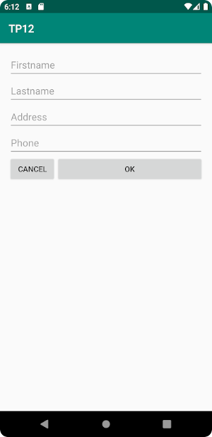

# TP1 : Prise en main du framework

- faire des commits réguliers et commentés à bon escient
- faire un push en fin de séance

## Exercice 1 : Cycle de vie d'une activité

Créer une application composée d'une seule activité qui affiche un `Toast` à chaque changement d'état.

## Exercice 2 :  Formulaire et changement d'activité

Créer une application composée de deux activités :

| Activité principale | Activité secondaire |
|:-------------------:|:-------------------:|
|   |   |

1. Dans l'activité principale, l'utilisateur saisit son nom, prénom, numéro de téléphone. Un bouton "Effacer" permet d'effacer tous les champs. Le bouton "Envoyer" permet d'envoyer les informations à la seconde activité. L'interface utilisateur utilise un layout de type `LinearLayout`.
2. La seconde activité réceptionne les données et les affiche de manière structurée à l'écran.
3. Remplacer le `LinearLayout` par un `ConstraintLayout`
4. Sauvegarder dans les préférences partagées les champs saisis dans la première activité, lorsque l'application est fermée. Les champs doivent être restaurés quand l'application est relancée.
