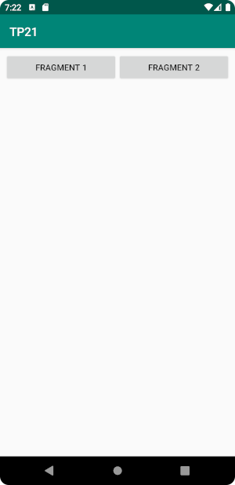
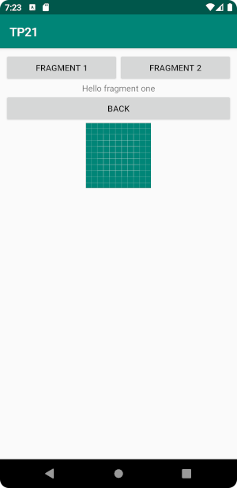
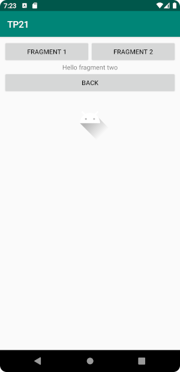
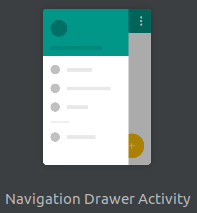

TP2 :  Fragment, NavigationDrawer
=================================

- faire des commits réguliers et commentés à bon escient
- faire un push en fin de séance

Exercice 1 : Des fragments dynamiques
-------------------------------------

| Vue initiale        | Clic sur "Fragment 1" | Clic sur "Fragment 2" |
|:-------------------:|:---------------------:|:---------------------:|
|  |    |    |

1. Créer un nouveau projet vide.
2. Créer une activité principale.
3. Définir deux fragments avec leur constructeurs qui doivent ressembler à ceci :
```java
public FragmentX() {
    super(R.layout.fragment_fragment_x);
}
```
4. Ajouter au layout de chaque fragment un texte, un bouton et une image.
5. Dans le layout de l'activité, ajouter :
- Deux boutons pour afficher l'un ou l'autre des deux fragments dans le conteneur.
- Un `FragmentContainerView` qui permettra d'afficher alternativement chacun des deux fragments.
6. Mettre en place l'affichage dynamique des fragments avec, sur chacun des boutons, un évènement qui fait appel à un `FragmentManager` pour afficher le fragment correspondant dans le conteneur. Les deux transactions doivent :
	- être ajoutées à la pile de retour des fragments
	- avoir une transition graphique différente
7. Faites en sorte qu'un clic sur le bouton présent sur chaque fragment "dépile" la dernière transaction du `FragmentManager` de l'activité qui l'a affiché. Passer pour cela par une surcharge de la méthode `onViewCreated`.

Exercice 2 : NavigationDrawer
-----------------------------



Documentation : https://developer.android.com/guide/navigation/navigation-ui#add_a_navigation_drawer

C'est un panneau rétractable qui affiche des options de navigation au sein d'une application. Généralement le `NavigationDrawer` s'utilise avec des fragments : chaque sélection d'une option affiche un nouveau fragment dans la vue principale.

1. Créer un nouveau projet basé sur le template `Navigation Drawer Activity`.
2. Creer deux nouveau fragments nommés `TransmitterFragment` et `ReceiverFragment`.
3. Ajouter ces fragments :
    - à la navigation : `res/navigation/mobile_navigation`
    - au menu : `res/menu/activity_main_drawer`
    - comme menu "top level" : `MainActivity`
4. Faite comuniquer les deux fragments à travers un `ViewModel`:
    - `TransmitterFragment` doit contenir un `EditText` dont le contenu est conservé dans le `ViewModel`
    - `ReceiverFragment` doit contenir un `TextView` qui affich le contenu du `ViewModel`
