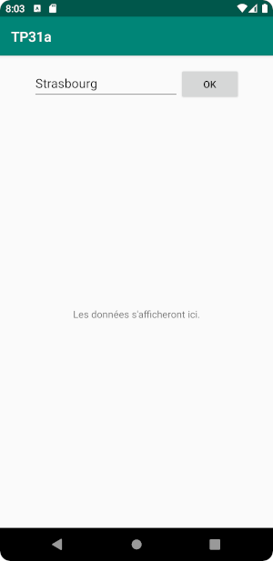
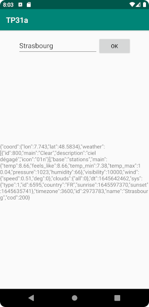
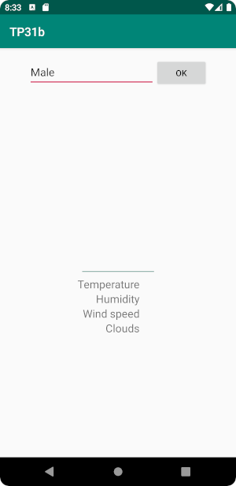
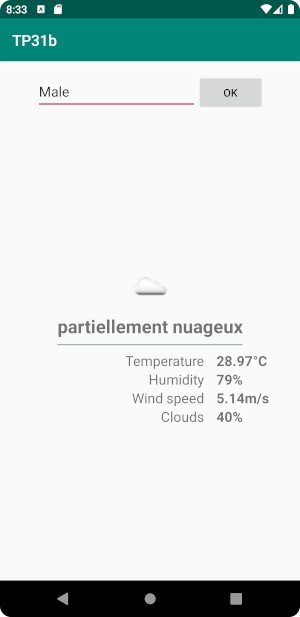

TP3 : Volley
============

Exercice 1 : OpenWeatherMap
---------------------------

L'objectif est d'écrire une application Android qui affiche la météo actuelle d'une ville choise par l'utilisateur en intérrogeant le service OpenWeatherMap grâce à la bibliothèque Volley (voirs cours).

Documentation de l'API : https://openweathermap.org/current

#### Préparation

1. Créer un compte : https://home.openweathermap.org/users/sign_up
2. Creer une clé d'API : https://home.openweathermap.org/api_keys

#### Réalisation

Les deux étapes ci-dessous pourront être réalisées dans une seule activité, sans fragment.

| Vue initiale           | Affichage non structuré     |
|:----------------------:|:---------------------------:|
|  |  |

1. Effectuer une requête vers l'APi pour obtenir la météo du jour et affichez le JSON brut de la réponse dans un `TextView` sur le layout de l'activité.

| Vue initiale                     | Affichage structuré       |
|:--------------------------------:|:-------------------------:|
|  |  |

2. Compléter l'application pour afficher les informations principales (température, humidité, vitesse du vent, couverture nuageuse) de manière structurée.

3. En bonus, afficher l'icône dont le nom est obtenu dans la première requête. Il faut pour cela effectuer une seconde requête avec Volley. Deux liens :
	- les infos de l'API OWM : https://openweathermap.org/weather-conditions
	- L'`ImageRequest` de Volley : https://github.com/google/volley/blob/master/core/src/main/java/com/android/volley/toolbox/ImageRequest.java
